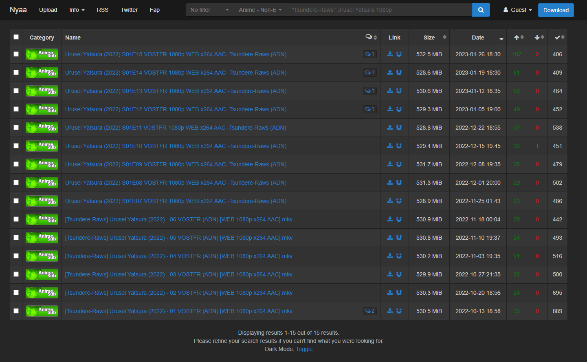

# Nyaa.si Download all button

> This script is largely inspired by this script that you can find [here](https://github.com/Johnsen92/nyaa_downloader)

> Import the script in `Violentmonkey` to use it and have fun!

The script adds a button "Download" next to the top right nav bar which on-click emulates
a mouse click on all selected torrent links appearing in the search results on this searchpage. This enables the user to download multiple torrents at once instead of clicking on every link individually.

## Use-case
The user wants to download e.g. all episodes of a single anime. So he would refine his search
parameters to ultimately only having all the episodes of the desired anime from one fansubber group with one resolution
in his search results and then clicks "Download" to import all at once into his torrent client.

E.g. for search parameters: Category = Anime - English-translated, Search = "Kimetsu no Yaiba horrible 1080" and then click 
on "Download" to download all selected torrents at once.